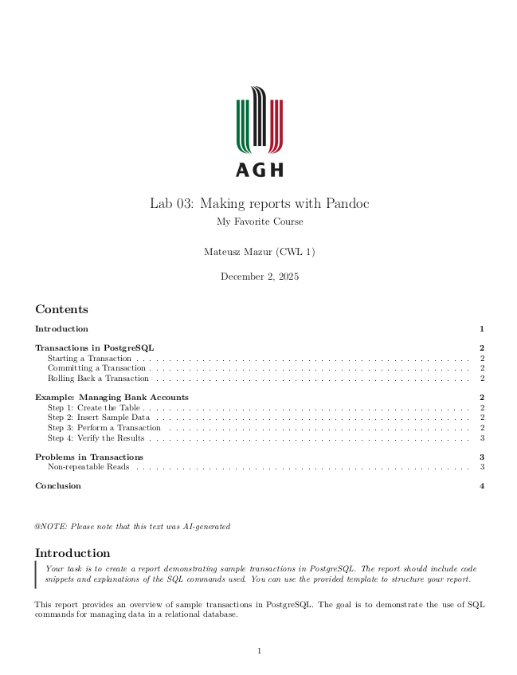
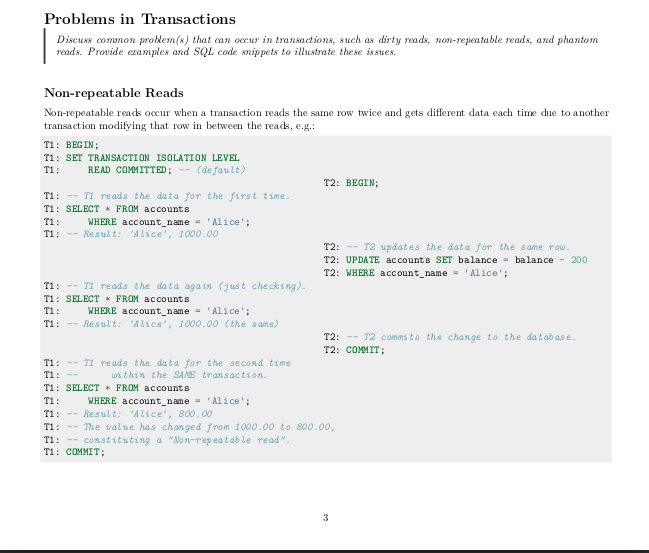

# Pandoc AGH Report Theme

A Pandoc theme for writing reports and lab exercises at AGH University of Science and Technology.



## Features

- Customizable title page with university logo
- Object referencing and numbering with pandoc-crossref
- Table of contents
- Custom code syntax highlighting (with background)
- Support for two terminals side by side in code blocks
- Easy to use with Pandoc



## Requirements

- Pandoc, v3.6
- pandoc-crossref v0.3.18.0 
- pandoc-types v1.23.1
- Scripting engine Lua v5.4

## Usage

```bash
just pdf <lab-name>
```

Will create a PDF report for the specified lab (or project).

### Customization

#### Title Metadata

You are expected to pass the title metadata inside the lab source file, e.g.:

```markdown
<!-- labX/labX.md -->
---
title: "Lab X: Some Topic"
---

...
```

#### Course name, author name, title page logo

These can be customized in the `meta.md` file:

```yaml
subtitle: "Course Name"
author: "Author Name"
title-logo: "path/to/logo.png" # Path/url to the logo image file 
title-logo-width: X # default is 3cm, accepts numbers as cm units
```


### Course and Author Shortnames

The output pdf will be placed inside the lab folder and named using the following pattern:

```
<COURSE_SHORTNAME>-<lab-name>-<AUTHOR_SHORTNAME>.pdf
```
